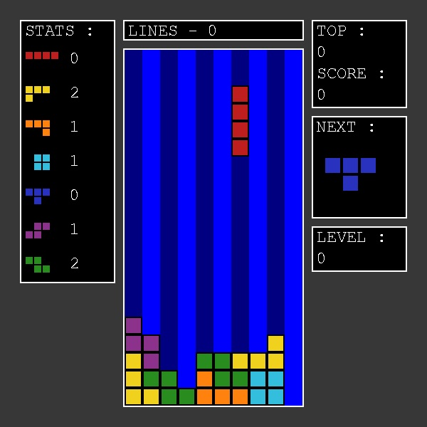

# Python-Tetris-Game

This is a reproduction of the Tetris NES game.
## Features
- Score and highscore
- Pause and play the game
- Different levels
## Installation
1. Download the repository by clicking on `Code > Download ZIP`
2. Extract the ZIP file
3. Run `main.pyw`
## Requirements
- Python 3.7
- Python `contextlib` library
- Python `pygame` library
- Python `random` library
## Usage
Use the `LEFT` and the `RIGHT` arrow keys to move pieces horizontaly.

To make the pieces fall faster you can use the `DOWN` arrow key.

To rotate pieces you have to use `Q` and `W`.

And to pause the game you have to use `ENTER`.